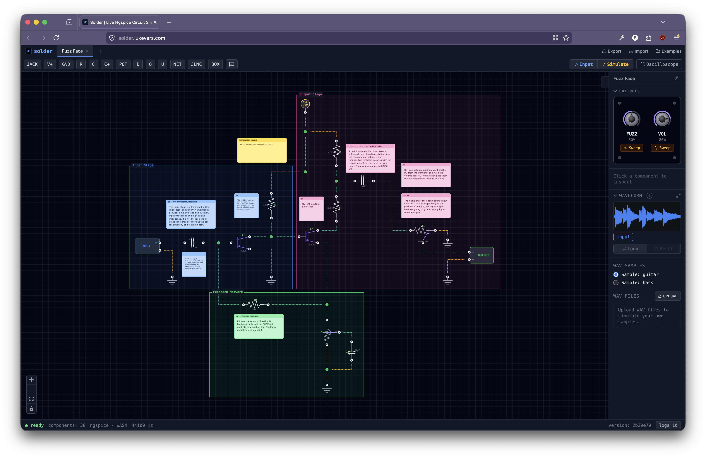

# Solder



A visual circuit editor and audio effects simulator that runs entirely in your browser. Draw a schematic, drop in a guitar sample, and hear what it sounds like through the simulated circuit — no install, no server, no SPICE setup.

Solder compiles your schematic to a SPICE netlist and runs it through ngspice compiled to WebAssembly. It is intentionally small-scoped: analog audio circuits like guitar pedals, EQs, and clipping stages.

## Try it

```bash
pnpm install
pnpm dev
```

Open [http://localhost:5173](http://localhost:5173). A modern browser with WebAssembly and SharedArrayBuffer is required — the dev server
sets the Cross-Origin Isolation headers ngspice needs to work.

When the editor loads, click **Examples** in the toolbar to load a starter circuit, then **Simulate** to hear it.

## What it does

- **Schematic editor** — drop components, drag connections, multi-tab circuits, undo/redo, JSON import/export. KiCad-style power pins and global net labels keep wiring tidy.
- **Place-symbol command bar** — press `a` to search the full component catalog (resistors, capacitors, op-amps, diodes, BJTs, JFETs, MOSFETs, potentiometers, etc.) with KiCad-style recent-items at the top.
- **Simulate audio** — use one of the bundled samples, upload your own WAV, or fall back to a SIN test tone. Select a region of the input waveform to simulate only a portion. Hear input and output, or scrub the overlay to see how the circuit shapes the signal.
- **Bundled examples** — filters, gain stages, clipping circuits, plus three complete pedals (ProCo RAT, MXR Distortion+, Fuzz Face). Each ships with inline notes explaining what every section does. See [`docs/examples.md`](docs/examples.md).

## Quick keyboard reference

| Shortcut          | Action                                             |
| ----------------- | -------------------------------------------------- |
| `a`               | Open the place-symbol command bar                  |
| `r` / `Shift+R`   | Rotate selection 90° clockwise / counter-clockwise |
| `⌘/Ctrl+Z`        | Undo                                               |
| `⌘/Ctrl+Shift+Z`  | Redo                                               |
| `?` or `/`        | Open the in-app keyboard reference                 |

Full list: [`docs/keyboard-shortcuts.md`](docs/keyboard-shortcuts.md). Press `?` in the editor for the same reference as a modal.

## Documentation

User-facing:

- [`docs/examples.md`](docs/examples.md) — tour of the bundled circuits and pedals, and what each one teaches.
- [`docs/keyboard-shortcuts.md`](docs/keyboard-shortcuts.md) — full shortcut list.

Contributor-facing:

- [`AGENTS.md`](AGENTS.md) — entry point for anyone (or any agent) working on the codebase. Routes to everything below.
- [`docs/architecture.md`](docs/architecture.md) — Zustand store layout, slices, hooks, data flow.
- [`docs/component-library.md`](docs/component-library.md) — how `src/lib/models/` is organized; the three places you have to register a new component.
- [`docs/simulation.md`](docs/simulation.md) — netlist compiler and the ngspice/eecircuit-engine quirks that will silently break things if you ignore them.
- [`docs/audio.md`](docs/audio.md) — `AudioPipeline`, browser autoplay policy, IndexedDB sample persistence.
- [`docs/ui-patterns.md`](docs/ui-patterns.md) — palette catalog, global hotkey gating, modal opt-in, example circuit conventions.
- [`docs/code-style.md`](docs/code-style.md) — early returns, block comments, file organization, typography.

## Commands

```bash
pnpm dev          # Start dev server with HMR
pnpm build        # TypeScript compile + production build
pnpm preview      # Preview production build locally
pnpm lint         # Lint with Biome
pnpm test         # Run all tests (vitest)
pnpm test:ui      # Run tests with interactive Vitest UI
```

## Tech stack

React 19, TypeScript, Vite, [XYFlow](https://reactflow.dev) for the canvas, Zustand for state, Tailwind CSS, Biome for lint + format, and ngspice via [eecircuit-engine](https://www.npmjs.com/package/eecircuit-engine) running in a Web Worker. See [`docs/architecture.md`](docs/architecture.md) for how everything fits together.